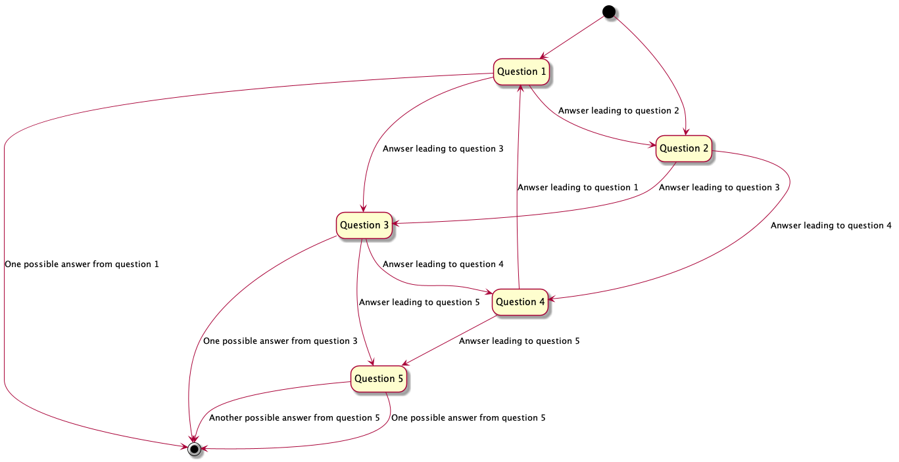

= Q&A
ifdef::env-github[]
:tip-caption: :bulb:
:note-caption: :information_source:
:important-caption: :heavy_exclamation_mark:
:caution-caption: :fire:
:warning-caption: :warning:
endif::[]

> Questions and Answers system based on PlantUML syntax

image:https://img.shields.io/github/workflow/status/rlespinasse/qanda/Build?style=for-the-badge&logo=github[build, link=https://github.com/rlespinasse/qanda/actions]
image:https://img.shields.io/badge/Made%20with-Bash-4EAA25.svg?style=for-the-badge[made-with-bash, link=https://www.gnu.org/software/bash]
image:https://img.shields.io/badge/Made%20with-PlantUML-4EAA25.svg?style=for-the-badge[made-with-plantuml, link=https://plantuml.com]
image:https://img.shields.io/badge/Made%20with-fzf-4EAA25.svg?style=for-the-badge[made-with-fzf, link=https://github.com/junegunn/fzf]

== Usage

. Write a https://plantuml.com[PlantUML] file like the sample file link:samples/simple_question.puml[**simple_question.puml**]
. Run `qanda` on your file
+
.From this repository
----
$ ./qanda.sh samples/simple_question.puml
Question 1
> This repository is call 'qanda'?
  [X] Yes
  [ ] No
----
+
.As docker image
----
$ docker pull rlespinasse/qanda
$ docker run -it -v $(PWD):/data rlespinasse/qanda my_qanda_file.puml
Question 1
> This docker image is call 'qanda'?
  [X] Yes
  [ ] No
----

== Write a source file

NOTE: You can use a `PlantUML` plugin to preview your file (see https://plantuml.com/running[plugins] page)

.Ask simple question
[%collapsible]
====
[cols="1a,2a"]
|===
| image::docs/images/simple_question.png[Simple Question]
|
----
@startuml qanda
hide empty description

state "This repository is call 'qanda'" as q1
' Define q1 as root question
[*] --> q1
' Propose possible answers
q1 --> [*] : Yes
q1 --> [*] : No
@enduml
----
|===
====

.Ask another question
[%collapsible]
====
[cols="1a,2a"]
|===
| image::docs/images/another_question.png[Another Question]
|
----
@startuml qanda
hide empty description

state "This repository is call 'qanda'" as q1
' Define q1 as root question
[*] --> q1
' Propose possible answers linked to the other question
q1 --> q2 : Yes
q1 --> q2 : No

state "Are you sure" as q2
q2 --> [*] : Yes
q2 --> [*] : No
@enduml
----
|===
====

.Ask a question with tasks to do
[%collapsible]
====
[cols="1a,2a"]
|===
| image::docs/images/question_with_tasks.png[Question with tasks to do]
|
----
@startuml qanda
hide empty description

state "This repository is call 'qanda'" as q1
' Add some context
q1 : Check the folder name
q1 : Check the origin remote url with 'git remote -v'
' Define q1 as root question
[*] --> q1
' Propose possible answers
q1 --> [*] : Yes
q1 --> [*] : No
@enduml
----
|===
====

.Ask multiple questions
[%collapsible]
====
[cols="1a,2a"]
|===
| image::docs/images/multiple_questions.png[Multiple Questions]
|
----
@startuml qanda
hide empty description

state "This folder is call 'qanda'" as q1
' Define q1 as root question
[*] --> q1
' Propose possible answers linked to the other question
q1 --> q2 : Yes
q1 --> q3 : No

state "Are you sure" as q2
q2 --> [*] : Yes
q2 --> q3 : No

state "This folder is a git repository" as q3
q3 --> q4 : Yes
q3 --> [*] : No

state "This repository is call 'qanda'" as q4
' Add some context
q4 : Check the origin remote url with 'git remote -v'
q4 --> [*] : Yes
q4 --> [*] : No
@enduml
----
|===
====

.Run a complex workflow of questions
[%collapsible]
====
----
@startuml qanda
hide empty description

state "Question 1" as q1
[*] --> q1
q1 --> q2 : Anwser leading to question 2
q1 --> q3 : Anwser leading to question 3
q1 --> [*] : One possible answer from question 1

state "Question 2" as q2
[*] --> q2
q2 --> q3 : Anwser leading to question 3
q2 --> q4 : Anwser leading to question 4

state "Question 3" as q3
q3 --> q4 : Anwser leading to question 4
q3 --> q5 : Anwser leading to question 5
q3 --> [*] : One possible answer from question 3

state "Question 4" as q4
q4 --> q1 : Anwser leading to question 1
q4 --> q5 : Anwser leading to question 5

state "Question 5" as q5
q5 --> [*] : One possible answer from question 5
q5 --> [*] : Another possible answer from question 5
@enduml
----

====
